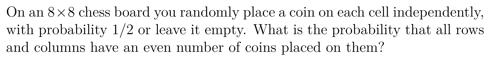

Make a 64-bit bitboard representing an 8x8 grid, and make functions to read and set a coordinate pair

Make a function which determines if any two neighboring bits are both ones on that 8x8 grid

Make a function which determines if there is a one in every row on that 8x8 grid

Estimate the answer to this combinatorics problem using a bitboard:

